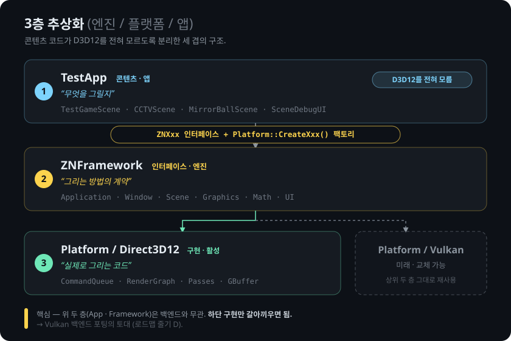

# ZNEngine 개발 로그

D3D12 기반 커스텀 렌더링 엔진 **ZNEngine**의 개발 과정. 각 단계는 당시의 스크린샷·gif·영상과 관련 PR로 정리한다.

---

## 개요

| 단계 | 내용 | PR |
|---|---|---|
| 아키텍처 | 3층 추상화, 자체 수학 라이브러리, 렌더 골격 | [#17](https://github.com/j-jiwon/ZNEngine/pull/17) |
| PBR / IBL | Cook-Torrance, split-sum IBL, 디스코 코스틱 | [#13](https://github.com/j-jiwon/ZNEngine/pull/13) · [#21](https://github.com/j-jiwon/ZNEngine/pull/21) |
| 오프스크린 렌더 | 오프스크린 카메라, CCTV→TV 합성 | [#18](https://github.com/j-jiwon/ZNEngine/pull/18) |
| HDR 파이프라인 | HDR, Bloom, 톤매핑 | [#21](https://github.com/j-jiwon/ZNEngine/pull/21) |
| 구조 리팩터링 | 계층 모델, 소유권/핸들, 렌더 순회 통합 | [#22](https://github.com/j-jiwon/ZNEngine/pull/22) |
| Automotive | 실시간 3D 시각화, 멀티카메라 서라운드뷰 | 진행 중 |

---

## 1. 아키텍처 — 기반 구조

초기 작업의 결과물은 화면이 아니라 **구조**였다. 서드파티 프레임워크를 얹지 않고, 밑바닥부터 직접 설계·구현했다. 아래 네 가지가 이후 모든 기능이 올라가는 기반이 된다.

### 3층 추상화 (엔진 / 플랫폼 / 앱)
콘텐츠 코드가 D3D12를 전혀 모르도록 분리한 세 겹의 구조.
```
TestApp (콘텐츠)          "무엇을 그릴지"        — D3D12를 모름
   ↓  ZNXxx 인터페이스 + Platform::CreateXxx() 팩토리
ZNFramework (인터페이스)   "그리는 방법의 계약"
   ↓
Platform/Direct3D12       "실제로 그리는 코드"
```
이 경계가 이후 Vulkan, Metal 등 다양한 플랫폼 포팅의 토대가 된다.



### 자체 수학 라이브러리
`DirectXMath`에 의존하지 않고 직접 구현한 Vector / Matrix / Transform. 좌표계와 행렬 규약을 직접 정의해 파이프라인 전체를 통제한다.

### 플랫폼 계층 (Win32, D3D12 초기화)
Win32 윈도우와 이벤트 루프, D3D12 디바이스 / 스왑체인 / 커맨드큐 초기화. 부팅 시퀀스를 직접 구성했다.

### 렌더 골격 (RenderGraph, 프레임 루프)
named `RGResource` 핸들 기반 RenderGraph와 자동 배리어, 프레임 루프.
```
MessageLoop → Update() → Render()
  → RenderBegin()  (첫 프레임: BuildRenderGraph)
  → renderGraph.Execute(cmdList)   ★ 모든 패스가 여기서 순서대로 실행
  → RenderEnd()  → Present → WaitSync → Swap
```
이후 Bloom·ToneMap·IBL 패스가 그래프에 한 줄 등록만으로 추가될 수 있는 이유가 이 골격이다.

> 렌더 골격 · [PR #17](https://github.com/j-jiwon/ZNEngine/pull/17)

---

## 2. PBR / IBL

미러볼 씬에서 물리 기반 렌더링을 구현했다. Cook-Torrance 직접광 위에 split-sum IBL(irradiance, prefiltered, BRDF LUT)을 얹고, 해석적 디스코 코스틱을 추가했다.


> PBR · [PR #13](https://github.com/j-jiwon/ZNEngine/pull/13) · IBL / 디스코 코스틱 · [PR #21](https://github.com/j-jiwon/ZNEngine/pull/21)

---

## 3. 오프스크린 렌더

임의의 카메라를 렌더 텍스처에 담고, 이를 다시 씬 안 TV 머티리얼로 합성했다(CCTV 씬). 이 오프스크린 인프라가 이후 멀티카메라·서라운드뷰의 기반이 된다.

<!-- MEDIA: CCTV→TV 합성 gif URL -->

> 오프스크린 카메라 → RT → TV 머티리얼 · [PR #18](https://github.com/j-jiwon/ZNEngine/pull/18)

---

## 4. HDR 파이프라인

`R16G16B16A16_FLOAT` SceneColor 기반 HDR 파이프라인. Bloom과 톤매핑(ACES)을 추가했다.

<!-- MEDIA: Bloom 전/후 비교 스크린샷 URL -->

> HDR + Bloom + 톤매핑 · [PR #21](https://github.com/j-jiwon/ZNEngine/pull/21)

---

## 5. 구조 리팩터링

기능이 아니라 구조를 정리한 단계. automotive 확장을 위한 사전 정비였다.

- **계층 모델** — 모델 하나가 메쉬 N개로 흩어지던 것을 루트+자식 구조로 묶음. Outliner가 트리로 전환.
- **소유권 + 핸들** — raw 포인터 벡터를 명확한 소유권과 안정적 ID로 대체. dangling 제거, Add/Remove를 O(1)에 근접.
- **렌더 순회 통합** — Render / Shadow / Forward의 중복 순회를 카테고리 필터 하나로 통합.
- **입력 프레임 기반화, 채널 로깅** — 조작 반응성과 디버깅 품질 개선.

<!-- MEDIA: Outliner 평면 나열 → 트리 before/after URL -->

> 계층, 핸들, 순회 통합 · [PR #22](https://github.com/j-jiwon/ZNEngine/pull/22)

---

## 6. Automotive — 실시간 3D 시각화
진행중
